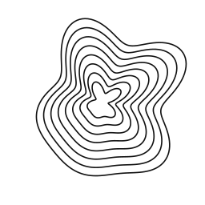

<p align="center">
  <picture>
    <source media="(prefers-color-scheme: dark)" srcset="public/contour-logo/contour-logo-white.svg">
    
  </picture>
</p>

# chele.bi

Personal blog and portfolio of [Ege Vusal Chelebi](https://www.chele.bi) ([@woosal1337](https://x.com/woosal1337)).

A dark, editorial personal site — writing, projects, and a reading shelf — built with Next.js 14 (App Router), MDX, Tailwind CSS, and Biome, deployed on Vercel.

## Highlights

- Editorial dark theme: Geist Sans for reading, Geist Mono for code, hairline borders, one motion curve.
- MDX blog with a left-rail table of contents, callouts, and per-post chrome.
- Post banners generated from the title — a deterministic contour mark (`lib/contour.ts`), no manual cover images.
- Liquid-glass circular controls and frosted-glass tags.
- A single contour identity mark drives the logo and favicons.

## Stack

- Next.js 14 (App Router), React 18, TypeScript
- MDX posts colocated under `app/(website)/blog/(post)/[slug]/page.mdx`
- Tailwind CSS with a token layer in `app/globals.css` (dark, editorial)
- Reusable design-system primitives in `components/ds/`, domain blocks in `components/blocks/`
- Biome for linting and formatting

## Local setup

```bash
bun install
bun dev
```

Requires Node >= 20 and Bun. No environment variables required.

## Commands

- `bun dev` — dev server
- `bun run build` — production build
- `bun run check` — Biome lint and format with auto-fix

## Credits

The animated line studies in `components/blocks/shape-study.tsx` use original geometry inspired by [Book of Shapes](https://bookofshapes.com/). Each page has its own composition. The 48-second loop repeats automatically without controls. Reduced motion shows a static view. The renderer groups strokes, scales curve detail to the width, and draws at 20 frames per second. The background grain uses a static texture. Run `bun tools/check-shape-studies.ts` to check loop continuity and canvas bounds.

The earlier ASCII components in `components/blocks/ascii/` remain from [cobanov/soft-club-ui](https://github.com/cobanov/soft-club-ui) (MIT). The table-of-contents marker geometry follows [ncdai's LineNav](https://chanhdai.com/components/line-nav).

## License

Code is MIT. Blog content and images are all rights reserved. See [LICENSE](LICENSE).
